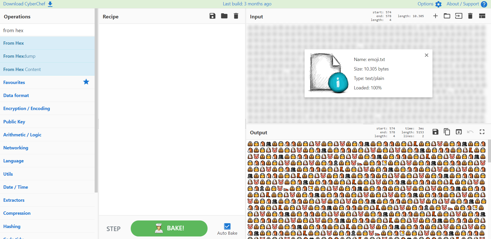
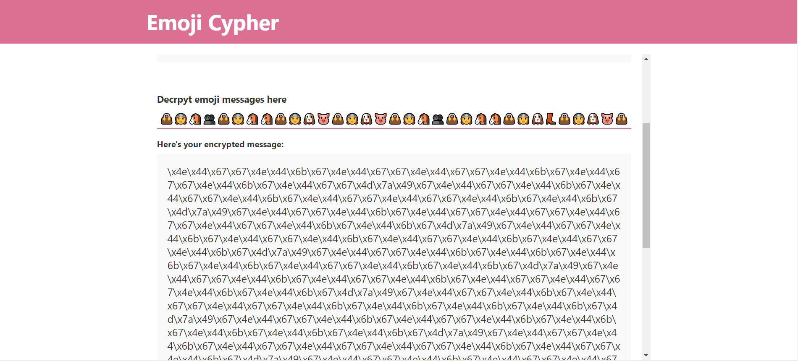
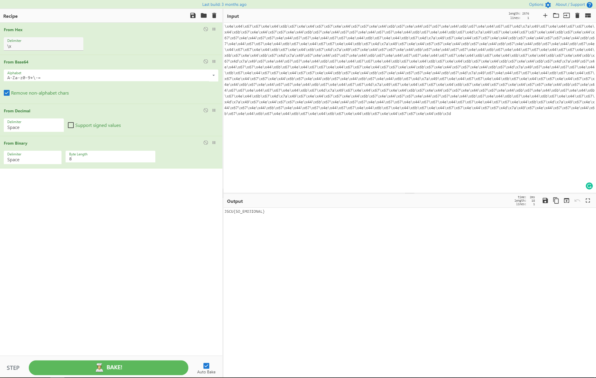

# Emoji challenge

## Omschrijving: 	

Iemand stuurde ons laatst dit bericht, maar helemaal begrijpen doen we het nog niet.

## Oplossing:

JSCU{SO_EMOJIONAL}

## Writeup:

Toen ik de link opende op de website, zag ik gelijk allemaal rare tekens. Gecombineerd met de naam 'Emoji', begreep ik direct dat dit om unicode encoding moest gaan. Allereerst probeerde ik de data te kopiëren en plakken in [CyberChef](https://gchq.github.io/CyberChef/) om het de decoden in emoji's. 

Dat lukte niet, totdat ik het ruwe bestand downloadde en direct in [CyberChef](https://gchq.github.io/CyberChef/) uploadde, toen kon ik het wel in Emoji's decoden. Dat laat deze foto:  zien. 

Ondertussen had ik al gegoogled op Emoji encryption en was ik de [Emoji Cypher](https://emoji-cypher.netlify.app/) website tegengekomen. Toen ik eenmaal de emoji's had, heb ik die op deze website gedecrypt, waar dit resultaat:  uit kwam. 

Daarna heb ik die output in [CyberChef](https://gchq.github.io/CyberChef/) gezet en had ik gelijk al het idee dat het hexidecimale code was. Toen ik het dus als Hex decode via `From Hex`, kwam er een tekst uit die er direct als Base64 uit zag. Nadat ik die tekst had gedecodeerd als Base64 via `From Base64` kwam er een set getallen uit. 

Ik wist niet direct wat ik daar mee moest doen, maar doen ik door [CyberChef](https://gchq.github.io/CyberChef/) scrollde kwam ik de optie `From decimal` tegen. Die geprobeerd en daar rolde binaire data uit. Die binaire data gedecodeeerd via `From binary` en daar kwam de flag uit. 

Het hele proces van decoderen kan in deze foto gezien worden: 