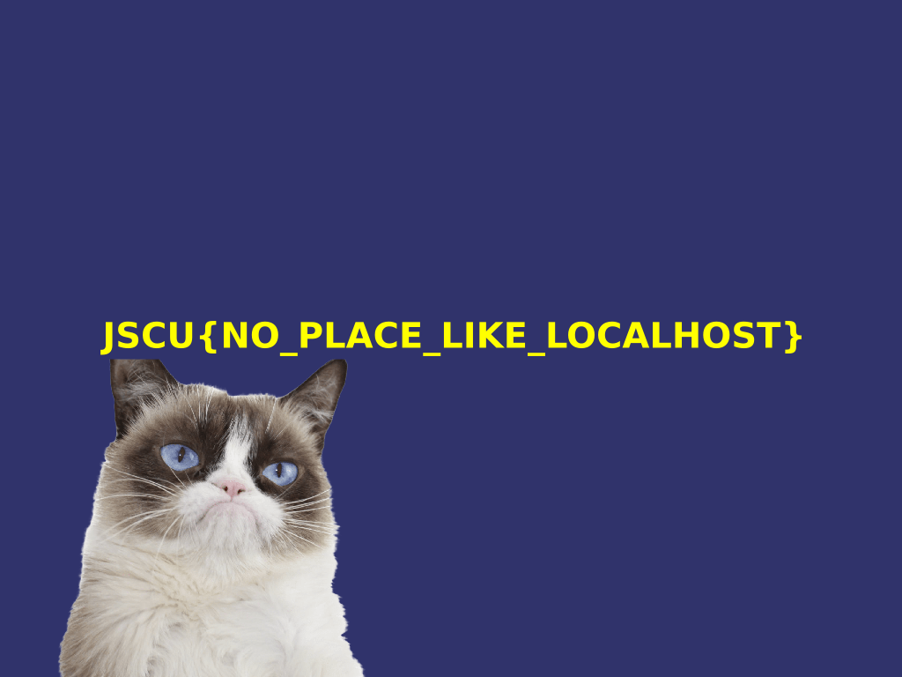

# ICMP challenge

## Omschrijving: 	

Is daar iemand?

## Oplossing:

JSCU{NO_PLACE_LIKE_LOCALHOST}

## Writeup:

Dit vond ik persoonlijk de leukste challenge, vooral toen ik de oplossing zag wist ik direct dat mijn programma goed werkte. 

Ik was al bekend met het concept van packet captures, dus direct het pcap bestand gedownload en in Wireshark gezet om te analyseren. Daar zag ik dat de packet capture bestond uit een paar honderd ICMP (Duhh) packets. Ik zag direct al dat het een grote sequence was en begon ik met het analyzeren van de data uit de IMCP packets. 

Wireshark decodeerd automatisch de hexadecimale data en daarom kwam een stuk tekst waar ik niet direct wist wat ik er mee moest doen. Dat stuk tekst heb ik toen maar direct in [CyberChef](https://gchq.github.io/CyberChef/) gezet, waar ik ook de tekst wat beter kon zien. Daar leek het iets meer op een Base64 geëncodeerd stuk tekst, dus daarom dat via Base64 gedecodeerd. Daar zag ik direct PNG, waardoor ik direct door had dat dit de file header was van een PNG bestand en dat de data van alle packets samen waarschijnlijk een plaatje zou vormen. 

In plaats van dat ik handmatig de data ging kopiëren, leek het mij een stuk makkelijker om daarvoor een script te schrijven. Voordat dat kon had ik eerste de packet data nodig in een bestandsformaat wat ik makkelijk uit kon lezen, dus daarom de packet capture via wireshark geëxporteerd naar JSON, waar ik erg bekend mee ben. 

Daarna ben ik begonnen aan mijn script om de data uit te lezen en samen te voegen in een plaatje. Dit script staat in [dit bestand.](analyze.py) Wat het script doet is dat het de [packets.json](packets.json) inleest, vervolgens alle data samenvoegt in 1 variable. Die variable decodeer ik vanuit Hexadicemaal en daarna vanuit Base64. Vervolgens schrijf ik alle gedecodeerde data naar een plaatje. 

Toen ik dat scripte runde, kwam er dit prachtige resultaat uit: 