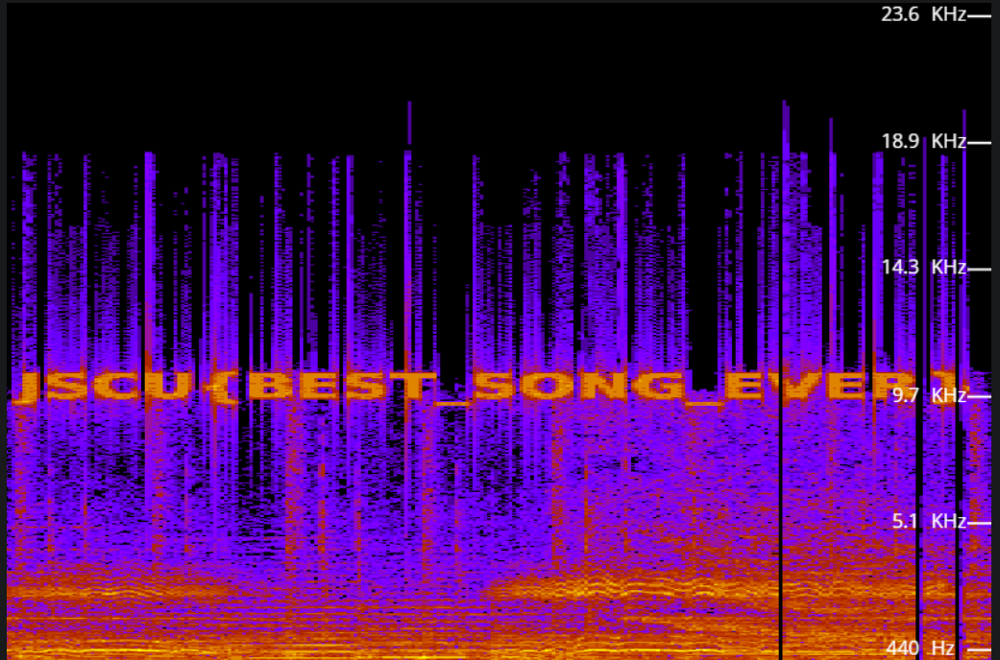

# Trololo challenge

## Omschrijving: 	

Dit nummer raakt ons. Er zit echt een diepere betekenis in verborgen.

## Oplossing:

JSCU{BEST_SONG_EVER}

## Writeup:

Toen ik deze challenge zag, dacht ik direct al dat ik het MP3 bestand via een Spectrum Analyzer zou moeten analyzeren, omdat ik toevallig de dag ervoor een video had gezien waarin spectrum analyse werd toegepast.

Toch eerst even naar het bestand geluisterd, maar de eerste keer niks aparts gehoord. Daarna even wat gegoogled over dit welbekende nummer of ik iets interessants kon vinden door OSINT, maar niks gevonden. Daarna toch nog een keer doorgeluisterd en toen hoorde ik een aantal hoge tonen rond 1:20.

Toen wist ik eigenlijk al genoeg. Het MP3 bestand in een online Spectrum Analyzer gedaan, naar 1:20 gegaan en daar kwam dit prachtige resultaat uit: 